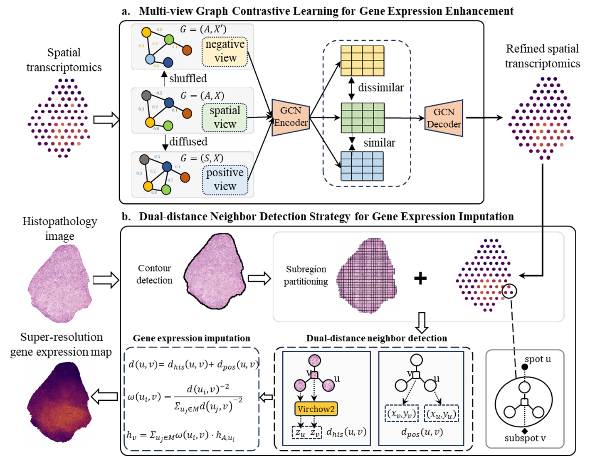

# MGCL-ST - A unified framework for morphology-aware,semantically consistent super-resolution gene expression imputation in spatial transcriptomics.
-----------------------------------------------------------------
This repository contains source code and usage for **MGCL-ST** 

## 1. Introduction

**MGCL-ST** is a multi-view graph contrastive learning framework designed for super-resolution imputation of spatial transcriptomics data. By integrating spatial transcriptomic profiles with high-resolution histological images, it constructs multi-view neighborhood graphs and learns robust spatial representations via contrastive learning. The framework further employs histology-guided neighbor selection to impute high-resolution gene expression at unmeasured locations, enabling enhanced characterization of tissue microenvironments and biological structures.
## 2. Design of MGCL-ST

Figure 1: Overall architecture of MGCL-ST

## 3. Usage

All the codes required to execute **MGCL-ST** are provided in this GitHub repository. Please make sure to replace the input data path in the code with your own storage location.And the Virchow2 model is publicly available at https://huggingface.co/paige-ai/Virchow2
